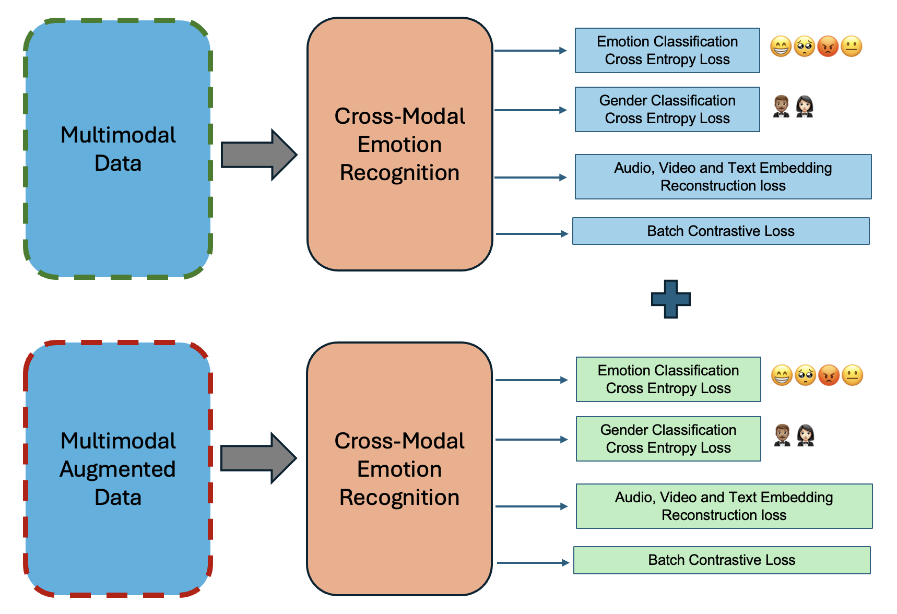
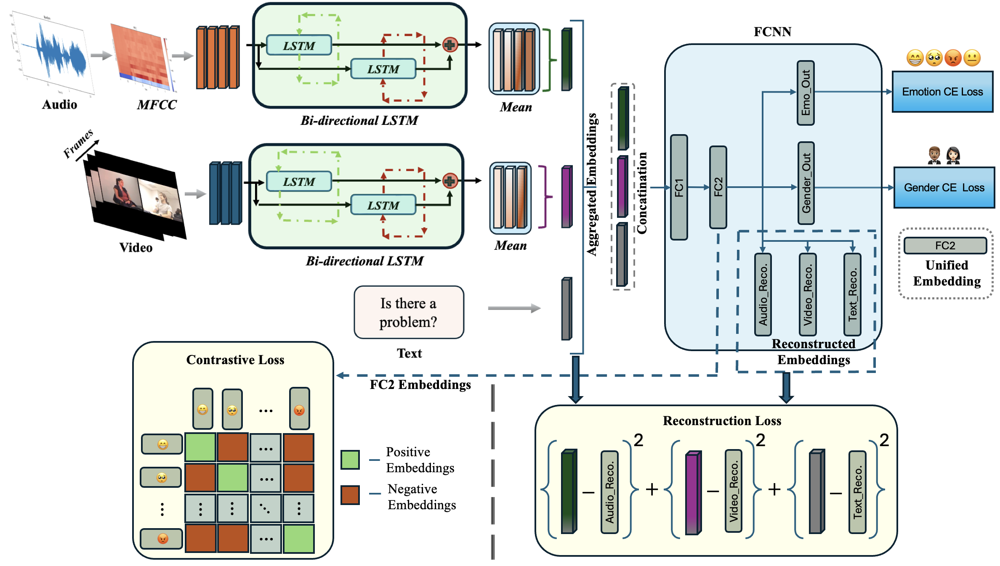

# Cross-Modal Emotion Recognition: A Unified Framework for Video, Audio, and Text Integration

This project presents a novel approach to multimodal emotion recognition, integrating video, audio, and text data. Our method generates a unified vector space using **multitask learning**, **contrastive learning**, and **autoencoder techniques**. The system outperforms current state-of-the-art methods on the IEMOCAP benchmark dataset.





## Requirements

- Python 3.x
- Install the required packages:
  ```bash
  pip install -r requirements.txt
